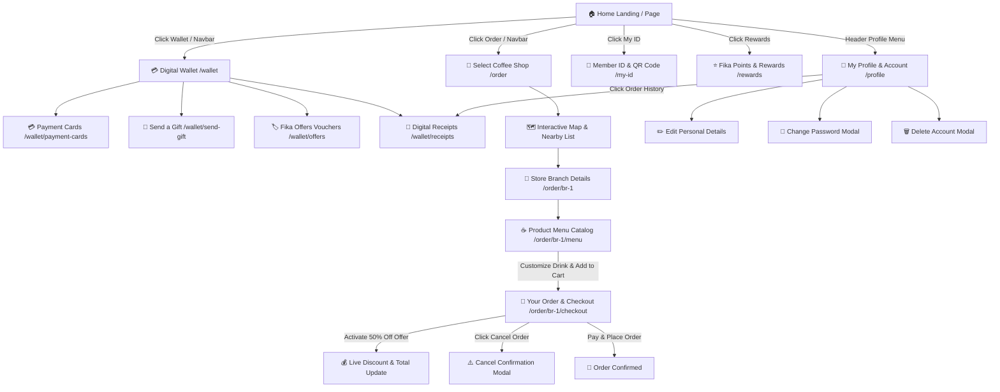

# ☕ Espresso House Client — Enterprise SaaS & Mobile Web Experience

A state-of-the-art, feature-complete web application and digital wallet for **Espresso House / FikaHub**, built with **Next.js (App Router)**, **TypeScript**, **Tailwind CSS**, and **Ant Design (v5)**.

This project delivers a premium coffee shop pre-ordering experience, digital loyalty wallet, barcode membership management, customizable menu ordering, live offer activation, digital thermal POS receipts, and comprehensive user account management.

---

## 🧭 Project Architecture & Complete Flow Overview



---

## 🌟 Comprehensive Feature & Page Breakdown

### 1. 📍 Store Selection & Interactive Pre-Order (`/order`)
- **Interactive SVG Map**: Vector map visualization with store branch pins (`C`, `G`, `S`) and live geolocation targeting (`🧭`).
- **Nearby vs. Latest Store Drawer**: Bottom sheet drawer with search filter (`Search for Coffee Shop`).
- **Store Detail View (`/order/[branchId]`)**: Store opening hours table (*Mon-Fri: 09:00 - 19:00, Sat: 10:00 - 18:00*), street address, Apple Maps shortcut, and store amenities (*Wifi, Child-Friendly, Express Checkout*).
- **Interactive Menu Catalog (`/order/[branchId]/menu`)**:
  - Horizontal category tabs (*Barista's Choice*, *App deals*, *Cold drinks*, *Hot drinks*, *Bakery*).
  - Search filter & dietary tags (*Seasonal Favourites*, *Combos*, *Drink Of The Month*).
  - **Drink Customization Modal**: Frapinomix milk selector (*Standard*, *Dairy Free*, *Oat Milk*), Whipped cream preference (*Standard*, *Light*, *No Cream*), Extra cream (+8 SEK), Extra espresso shot (+10 SEK).
  - Interactive cart drawer with floating checkout bar.

### 2. 🛒 Order Summary & Checkout (`/order/[branchId]/checkout`)
- **Pick Up Options**: `Take Away` / `At our place` tab switcher with store closing notice.
- **Itemized Products List**: Product thumbnails, customization labels, quantity steppers (`-`, qty, `+`), and 3-dots action menu (`⋮`) for **Modify**, **Remove**, or **Cancel Order**.
- **Expresso Offers Carousel**:
  - Live offer activation integration.
  - **Real-Time Discount**: Activating a 50% Off coupon instantly calculates `Discount: -39.00 SEK` and updates `In Total` in real-time.
- **Payment Selector**: `Coffee Card 0 SEK` (with Top Up modal trigger), `Payment Card`, `Paypal`, `Cash On Delivery`.
- **Cancel Order Confirmation Modal**: Drag handle modal asking *"This will cancel your ongoing order, are you sure you want to do this?"* with `[ Yes ]` and `[ No ]` buttons.

### 3. 💳 Digital Wallet & Member ID (`/wallet`, `/my-id`)
- **Member ID Card (`/my-id`)**: High-density barcode graphic, PIN display, member tier badge (*Gold Fika Member*), and barcode scanner popup.
- **Coffee Card Balance Box**: Displays active digital funds ($24.50 / SEK), quick top-up buttons ($10, $20, $50), custom top-up input, and payment method selector.
- **Payment Cards Manager (`/wallet/payment-cards`)**: Saved Visa/Mastercard management and add new card form.
- **Send a Gift Flow (`/wallet/send-gift`)**: Card design picker (*Happy Birthday*, *Thank You*, *Fika Time*), recipient email/phone input, personalized message, and custom gift amount.
- **Fika Offers Vouchers (`/wallet/offers`)**: Filterable coupons (*All*, *Active*, *Expired*) with reusable **Offer Detail Modal**.
- **Digital Receipts & Invoices (`/wallet/receipts`, `/orders`)**:
  - Total spent statistics and points earned log.
  - Search by store, order number, or product item.
  - **Thermal Receipt Paper Modal**: Realistic POS receipt preview with VAT calculations (12%), cashier ID, barcode graphic, **Download PDF**, and **Print Receipt** actions.

### 4. ⭐ Fika Points & Rewards (`/rewards`, `/challenges`)
- **Rewards Banner**: Loyalty points tracker (*142 pts available*), level status bar, and rewards redemption catalog.
- **Fika Points History (`/rewards/history`)**: Earned vs. redeemed points ledger.
- **Expresso Fun & Challenges (`/challenges`)**: Interactive scratch-and-win games, daily check-in streak rewards, and seasonal barista challenges.

### 5. 👤 User Profile & Account Management (`/profile`)
- **Profile Overview**: User avatar, tier badge (**Gold Fika Member**), and `[ Edit Profile ]` mode.
- **Editable Information**: Full Name, Email Address, Phone Number, Preferred Store, Birthday.
- **Account Preferences**: Switches for Digital Email Receipts, Offer Push Notifications, and Newsletters.
- **Change Password Modal**: Form with `oldPassword`, `newPassword`, and `confirmPassword` inputs, validation, and browser console payload logging (`console.log("🔐 Change Password Submitted:", ...)`).
- **Delete Account Modal**:
  - Warning box detailing coffee card balance loss and subscription cancellation terms.
  - Deactivation notice.
  - Checkbox agreement confirmation (`[ ] I have read and agree to the account deletion terms.`).
  - Submit deactivation request action.

---

## 🎨 Design System & Responsive Layout Alignment

- **Harmonious Palette**:
  - `#1e3932`: Espresso Dark Green (Primary brand accent & CTA buttons)
  - `#f7f8f6`: Warm Cream / Light Gray (Page background)
  - `#e8efe6`: Brand Sage (Card highlights & active states)
  - `#f59e0b`: Warm Amber (Fika Points & Star badges)
- **Responsive 2-Column Grid (`mx-auto max-w-md md:max-w-7xl px-4 sm:px-6 lg:px-8`)**:
  - All web views (`/wallet`, `/my-id`, `/order`, `/order/[branchId]/checkout`, `/profile`, `/wallet/receipts`) use a consistent container grid with left content cards and right sticky sidebar options on desktop screens.
  - Mobile view uses responsive sticky bottom bars with backdrop blur.

---

## 📊 Flow & Integration Audit

### ✅ Fully Implemented & Connected Flows
1. **Navigation Bar & Profile Menu**:
   - Header profile dropdown connects directly to `/profile`, `/wallet/receipts`, and `Sign Out`.
   - Bottom navigation connects `/`, `/wallet`, `/order`, `/rewards`, and `/my-id`.
2. **Order & Checkout Pipeline**:
   - Store selection ➔ Branch details ➔ Menu customization ➔ Cart drawer ➔ Checkout summary ➔ ExpressoOffers discount ➔ Payment selection ➔ Confirmation.
3. **Wallet & Receipts Pipeline**:
   - Top-up balance ➔ Payment cards ➔ Send a gift ➔ Offer activation ➔ Thermal POS receipt view & PDF download.
4. **Security & Profile Pipeline**:
   - Info editing ➔ Preferences toggles ➔ Change password modal ➔ Delete account terms confirmation.

### 💡 Suggested Future Enhancements (Backend API Extensions)
- **Authentication Routes (`/login`, `/register`)**:
  - Currently, `ROUTES.AUTH` constants are defined for `/login` and `/register`. In a production release, connect these to NextAuth.js or JWT auth backend services.
- **Real-Time POS WebSockets**:
  - Real-time notification updates when the barista changes order status (*Preparing ➔ Ready for Pickup*).

---

## 📁 Technical Directory Structure

```
espresso-house-client/
├── public/                     # Static assets (logos, drink images, icons)
├── src/
│   ├── app/                    # Next.js App Router route hierarchy
│   │   ├── challenges/         # Fika challenges & scratch games
│   │   ├── my-id/              # Member QR Code & Wallet page
│   │   ├── order/              # Interactive store map & ordering steps
│   │   │   └── [branchId]/     # Store details, menu catalog & checkout
│   │   ├── orders/             # Redirect alias to /wallet/receipts
│   │   ├── profile/            # User profile, password & account deletion
│   │   ├── rewards/            # Fika points & rewards history
│   │   ├── wallet/             # Digital wallet, top-up, cards, offers & receipts
│   │   ├── layout.tsx          # Root layout with AntdRegistry & Providers
│   │   └── page.tsx            # Main landing page
│   ├── components/             # Reusable UI component architecture
│   │   ├── common/             # Modals (Offer detail), Loading spinners, Empty states
│   │   ├── landing/            # Header, BottomNav, HeroCarousel, ExpressoOffers, ExpressoFun
│   │   ├── providers/          # Ant Design ConfigProvider & App wrapper
│   │   └── wallet/             # MemberIdCard, CoffeeCardBalance, FikaPointsBanner, WalletActionList
│   ├── config/                 # Application theme tokens & site metadata
│   ├── constants/              # Type-safe ROUTES definitions & constants
│   ├── data/                   # Mock stores (branches.ts) & menu catalog (products.ts)
│   ├── hooks/                  # Custom React hooks (use-is-mobile)
│   ├── lib/                    # API client & logger utilities
│   └── types/                  # TypeScript domain models & interfaces
├── eslint.config.mjs           # ESLint configuration
├── next.config.ts              # Next.js configuration
├── package.json                # Dependencies & scripts
├── postcss.config.mjs          # PostCSS configuration
└── tsconfig.json               # TypeScript configuration
```

---

## 🚀 Development & Build Commands

### 1. Run Development Server
```bash
npm run dev
```
Open [http://localhost:3000](http://localhost:3000) to view the application in your browser.

### 2. Type Check
```bash
npx tsc --noEmit
```

### 3. ESLint Static Analysis
```bash
npm run lint
```

### 4. Build Production Bundle
```bash
npm run build
```
